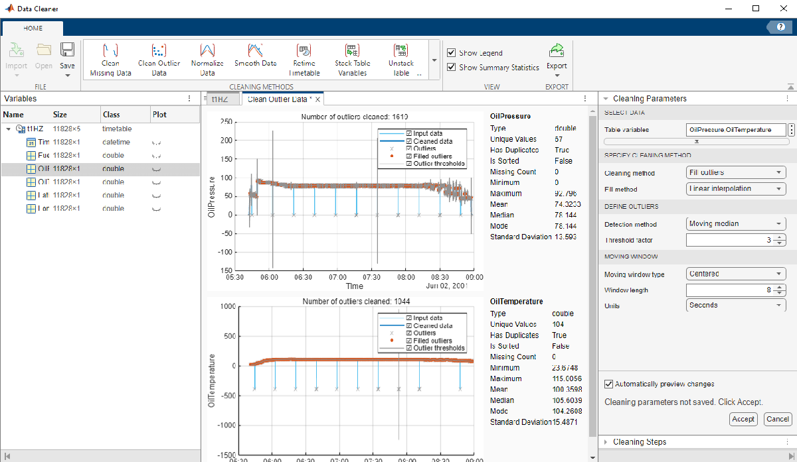
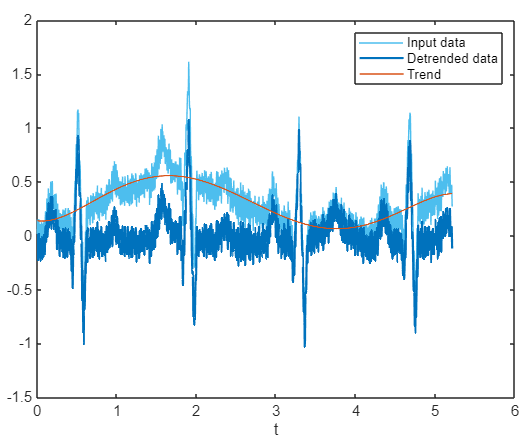

# Low\-code data analysis in MATLAB

This workshop focuses on introducing intaractive MATLAB tools for data analysis. We will:

-  Load data from various sources 
-  Visualize data using graphs 
-  Interactively edit raw data 
-  Share results 
# Cleaning Flight Data

This example show how to import CSV data, visualise route and clean data with Data Cleaner app. Two sensors are synchronized and we will finding data during flight based on changes in the signals. Regression model of True Air Speed will be trained with Regression Learner app.

# ECG signal analysis using Live Tasks

This example show how to remove the trend and noise from the signal with Live Editor Tasks. To demonstrate how Tasks can work, we will use an ECG signal measured from a device that is affected by electromagnetic interference. The Signal Analyzer app will be used to visualize signal and spectra.

